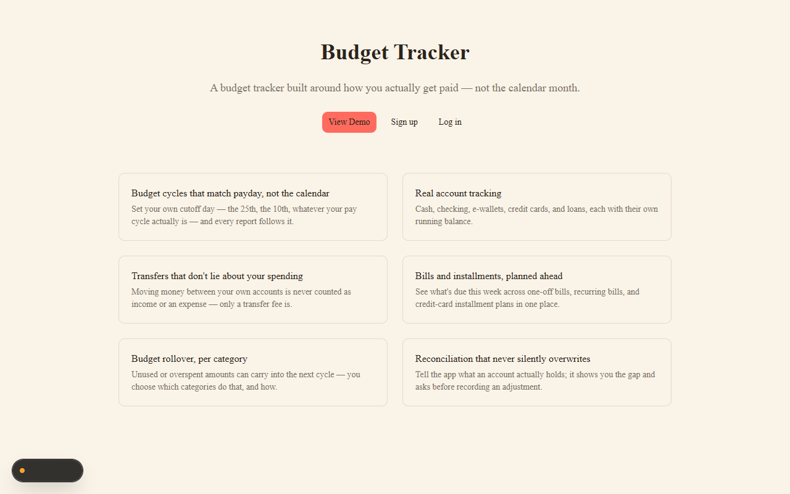
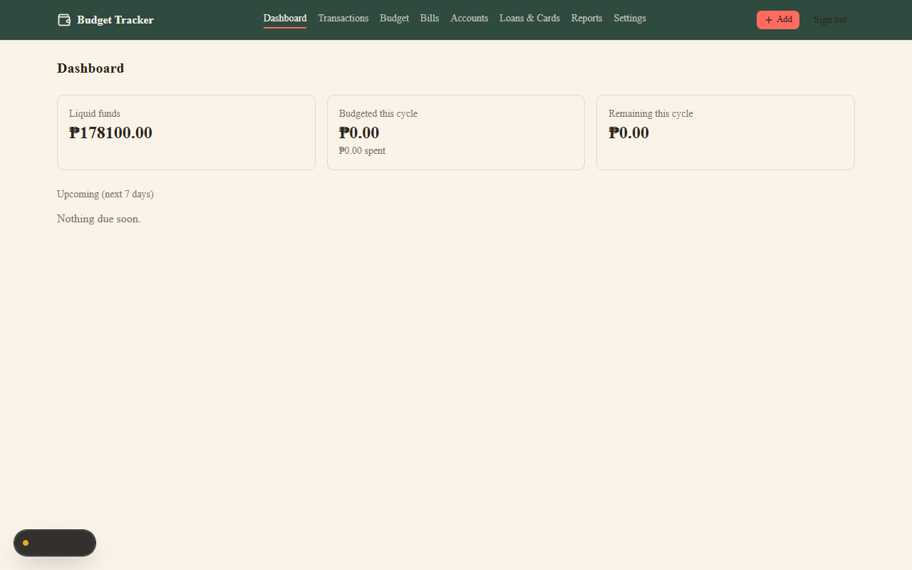
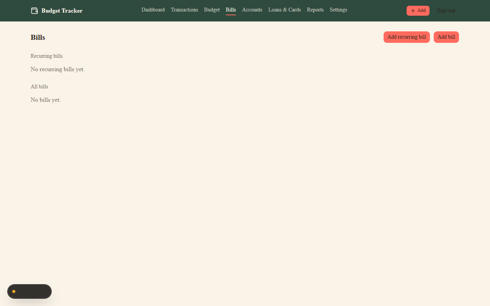
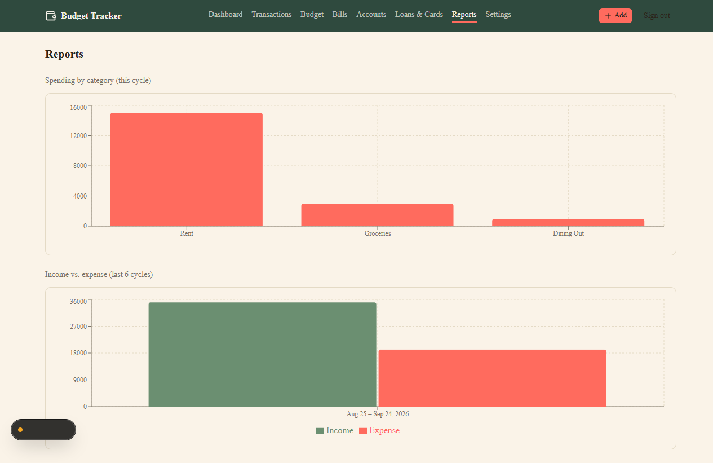
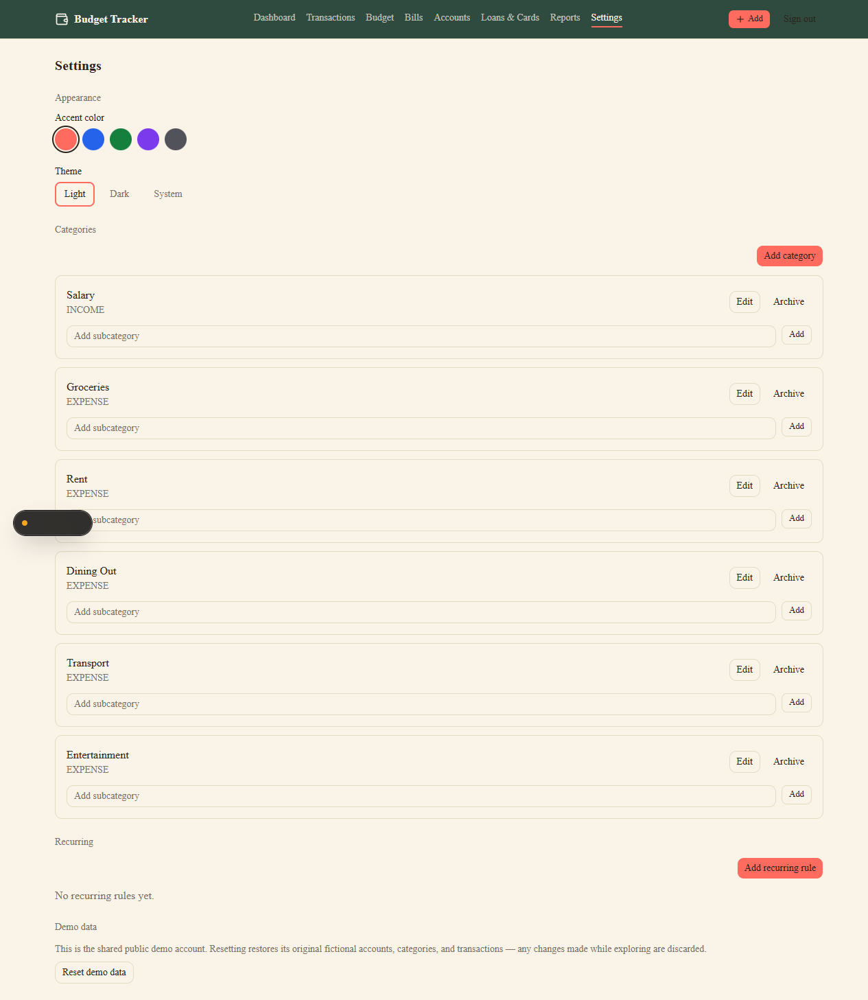

# Budget Tracker

A budget tracker built around how you actually get paid — not the calendar month. Set a custom pay-cycle cutoff day, track cash across multiple accounts, and get bills, installment plans, and budget rollover handled correctly instead of bolted on.

## Screenshots











## Core differentiators

- **Budget cycles that match payday, not the calendar** — set your own cutoff day (the 25th, the 10th, whatever your pay cycle actually is) and every report follows it.
- **Real account tracking** — cash, checking, e-wallets, credit cards, and loans, each with their own running balance.
- **Transfers that don't lie about your spending** — moving money between your own accounts is never counted as income or an expense; only a transfer fee is.
- **Bills and installments, planned ahead** — see what's due this week across one-off bills, recurring bills, and credit-card installment plans in one place.
- **Budget rollover, per category** — unused or overspent amounts can carry into the next cycle, per category, per how you configure it.
- **Reconciliation that never silently overwrites** — tell the app what an account actually holds; it shows you the gap and asks before recording an adjustment.

(This list is also shown on the app's own landing page — `src/app/page.tsx` — kept in sync by hand.)

## Tech stack

- [Next.js](https://nextjs.org) (App Router, TypeScript)
- [Tailwind CSS](https://tailwindcss.com)
- [shadcn/ui](https://ui.shadcn.com) components, built on [Base UI](https://base-ui.com) primitives (not Radix)
- [Prisma](https://www.prisma.io) ORM + SQLite for local development — the schema is written to not require a rewrite when switching to Postgres for production (see [`docs/ARCHITECTURE.md`](docs/ARCHITECTURE.md))
- [Auth.js](https://authjs.dev) (NextAuth v5), Credentials provider, passwords hashed with bcrypt
- [Recharts](https://recharts.org) (via shadcn-style chart components) for report charts
- [zod](https://zod.dev) + [react-hook-form](https://react-hook-form.com) for validation
- [Vitest](https://vitest.dev) for unit tests

## Getting started

```bash
git clone <this repo>
cd budget-tracker
npm install
cp .env.example .env   # then fill in AUTH_SECRET — see the comment in that file
npm run db:push        # applies prisma/schema.sql to a local SQLite database
npm run db:demo-user    # creates demo@example.com / demopassword123
npm run db:seed-demo    # seeds it with fictional demo data
npm run dev
```

Visit `http://localhost:3000` — you'll land on the public landing page if signed out. Click "View Demo" to log straight into the seeded demo account, or sign up for your own.

## A note on this dev environment

This particular development machine's Application Control policy blocks native `.exe` binaries downloaded by npm. That's why `npm run dev`/`npm run build` force `--webpack` instead of Next.js's default Turbopack, and why schema changes apply via a hand-written `prisma/schema.sql` mirror (`npm run db:push` → `scripts/db-push.mjs`) instead of `prisma db push` directly, which shells out to a native schema-engine binary. **Neither workaround is needed on a normal machine or deployment target** — they exist only because of this specific machine's policy, not because of anything about the app itself.

## Testing

```bash
npm test
```

Domain logic (`src/lib/*.ts`) is unit-tested against mocked Prisma clients — no test hits a real database. Server actions and pages are thin wrappers around that domain layer and are covered by manual browser verification during development rather than duplicated automated UI tests.

## Status

A personal portfolio project. Not accepting external contributions.
